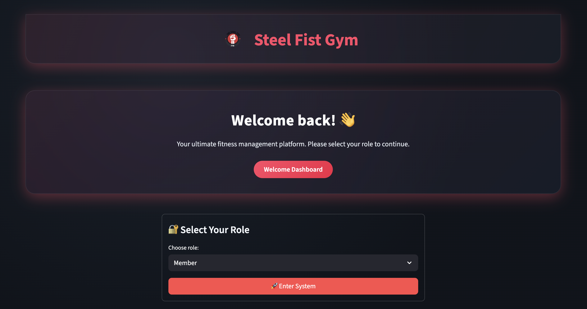

<div align="center">


# Steel Fist Gym Management Platform

Unified management & self‑service portal for a modern gym: members, coaches, courses, registrations & analytics — built with **Streamlit** + **SQLModel**.



</div>

---

## Overview

Steel Fist is a lightweight, single‑page style multi‑section web app that centralises day‑to‑day gym operations:

- Admins curate coaches & courses, manage members and view live registration intelligence.
- Members browse available classes, register, and review their enrolment history.
- A consistent dark glass + accent UI with reusable card components improves readability and speed of use.

The app emphasises: fast startup (SQLite + in‑process ORM), minimal config, idempotent seeded sample data (Faker), and clear role‑based navigation.

---

## Key Features

### Admin
- Coach management (create / update / delete)
- Course catalogue management (capacity, schedule, coach assignment)
- Member directory CRUD
- Registration oversight & aggregated analytics (counts, trends)
- Quick stats panel in sidebar

### Member
- Browse & filter available courses
- Register instantly (respecting capacity & duplicate guards)
- View personal registration history

### Platform / UX
- Role selection landing (header + sidebar hidden pre‑login for focus)
- Dynamic navigation via Streamlit experimental `st.navigation` API
- Unified typography & card styling (brand accent + glass panels)
- Real logo asset (favicon + in‑app) replacing placeholder emojis
- Responsive layout (wide mode) with adaptive metric cards

### Data Layer
- **SQLModel** ORM over **SQLite** (`steel_fist.db`)
- Entity relationships: Members ↔ Registrations ↔ Courses ↔ Coaches; Access Cards linked to Members
- Faker‑powered idempotent seeding script with `--force` reset option

---

## Architecture at a Glance

```
Streamlit (UI + Navigation)
    │
    ├── main.py (role gating, layout, sidebar, navigation)
    ├── pages/ (feature pages: manage_* , course_registration, analytics)
    ├── app_members.py (member registration workflow)
    │
    ├── styles.py (central CSS injection + components)
    ├── model.py (SQLModel definitions)
    ├── init_db.py (engine + table creation)
    ├── populate_db.py (seed / demo data)
    └── utils.py (helpers)
```

---

## Getting Started

### Prerequisites
- Python 3.10+ (tested with 3.12)
- pip / virtualenv (recommended)

### Installation
```bash
git clone https://github.com/<your-org-or-user>/the_steel_fist.git
cd the_steel_fist
python -m venv .venv
source .venv/bin/activate  # Windows: .venv\Scripts\activate
pip install --upgrade pip
pip install -r requirements.txt
```

### Initial Database Setup
Tables are auto-created on first run (via `init_db.py`). To populate demo data:
```bash
python populate_db.py         # seed only if empty
python populate_db.py --force # wipe & reseed
```

### Run the App
```bash
streamlit run main.py
```
Open the provided local URL (usually http://localhost:8501). Choose a role to enter the corresponding dashboard.

---

## Data Model Summary

| Table         | Purpose                               |
|---------------|----------------------------------------|
| Members       | Gym members                            |
| Accesscards   | Physical / digital access credentials  |
| Coaches       | Instructors                            |
| Courses       | Class offerings                        |
| Registrations | Member enrolments in courses           |

---

## Seeding Logic (populate_db.py)
Highlights:
- Uses Faker for realistic names & schedules
- Prevents duplicate seeding unless `--force` supplied
- Ensures referential integrity (coaches before courses; members before registrations)
- Randomised, bounded registration counts per member

---

## Styling System
Central CSS injection (`styles.py`) defines:
- Brand color variables (HSL accent)
- Glass + elevated card patterns
- Metric cards & feature cards
- Scoped overrides (dataframe font scaling)

Logo is embedded via base64 for reliable rendering inside custom Markdown blocks; favicon uses the asset path if available.

---

## Development Tips
| Action | Command |
|--------|---------|
| Install deps | `pip install -r requirements.txt` |
| Run app | `streamlit run main.py` |
| Seed DB | `python populate_db.py` |
| Force reseed | `python populate_db.py --force` |

Logically dead / legacy files (e.g., backups) can be pruned once verified obsolete.

---

## Contributing
1. Fork & create a feature branch: `git checkout -b feat/your-feature`  
2. Commit with conventional messages (e.g. `feat: add course capacity validation`)  
3. Open a Pull Request with context & screenshots  
4. Ensure seeding + app run locally without errors

Feel free to open issues for: bugs, UX polish, performance, test coverage.

---

## License
The project is licensed under the MIT license.

## Authors
**Original creators:** Michael Adebayo ([@MichAdebayo](https://github.com/MichAdebayo)) and Ludivine Raby ([@LudivineRB](https://github.com/LudivineRB))

**Maintainer of this fork:** Michael Adebayo ([@MichAdebayo](https://github.com/MichAdebayo)) 